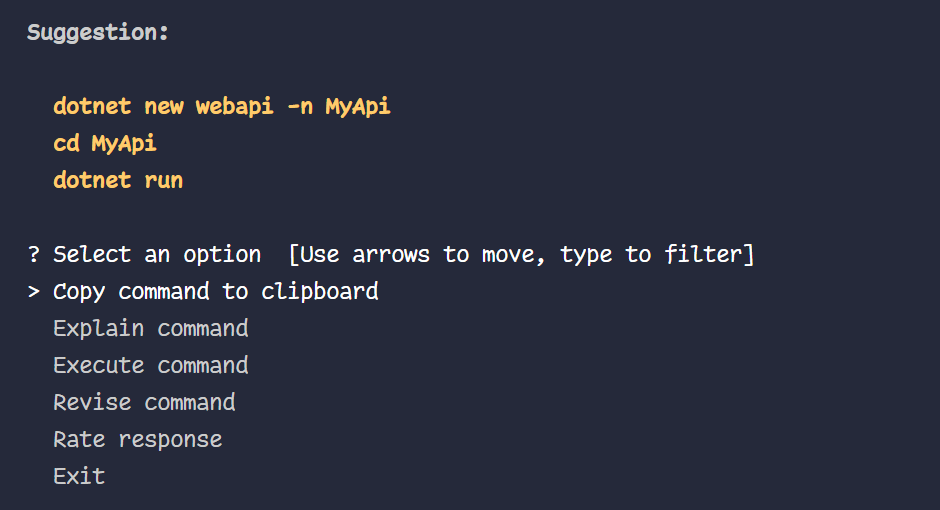

# Copilot NetCore + React Traning + VS2022

- Set up a new .NET Core web application.
- Create a React SPA for managing ticket sales.
- Use Tailwind CSS and React Suite to enhance the UI of the application.

## Prerequisites

- [.NET Core SDK](https://dotnet.microsoft.com/download)
- [Node.js](https://nodejs.org/en/)
- [Visual Studio 2022](https://visualstudio.microsoft.com/vs/)
- [Docker for Desktop](https://www.docker.com/products/docker-desktop)

## Step 1: Create a .NET Core API project using Copilot CLI.


1. Create a .NET Core API project using Copilot CLI.
    
```bash
ghcs "how to create a .NET Core API"
```



```bash
dotnet new webapi -n airline-ticket-sale-api
cd airline-ticket-sale-api
dotnet run
```	

- Open the project in Visual Studio 2022.

## Step 2: Create a Dockerized SQL Server database.

1. Create a Dockerized SQL Server database.

```bash
ghcs "how to run sql server on docker"
```

- `docker run -e 'ACCEPT_EULA=Y' -e 'SA_PASSWORD=<YourPassword>' -p 1433:1433 -d mcr.microsoft.com/mssql/server:2019-latest`

- If you don't have docker installed on your machine, you can download it from [here](https://www.docker.com/products/docker-desktop).
- Or you can install SQL Server Express on your machine from [here](https://www.microsoft.com/en-us/sql-server/sql-server-downloads).

> Check connection to SQL Server using SQL Server Management Studio or Datagrip.

## Step 3: Install Entity Framework Core and create a database context.

1. Install Entity Framework Core and create a database context.

```bash
ghcs "how to install entity framework core"
```

- `dotnet add package Microsoft.EntityFrameworkCore.SqlServer`
- `dotnet add package Microsoft.EntityFrameworkCore.Design`
- `dotnet add package Microsoft.EntityFrameworkCore.Tools`

- Create a `TicketSaleDbContext` class that inherits from `DbContext`.

```csharp
using Microsoft.EntityFrameworkCore;

namespace airline_ticket_sale_api
{
    public class TicketSaleDbContext : DbContext
    {
        public TicketSaleDbContext(DbContextOptions<TicketSaleDbContext> options) : base(options)
        {
        }
    }
}
```

- Register the `TicketSaleDbContext` in the `ConfigureServices` method in the `Startup` class.

```csharp
services.AddDbContext<TicketSaleDbContext>(options =>
{
    options.UseSqlServer(Configuration.GetConnectionString("DefaultConnection"));
});
```

- Add a connection string to the `appsettings.json` file.

```json
{
  "ConnectionStrings": {
    "DefaultConnection": "Server=localhost,1433;Database=TicketSaleDb;User=sa;Password=<YourPassword>"
  }
}
```

### Troubleshooting

Trust the SQL Server certificate.

> how to connecto my dockerized MS SQL Studio 2019 to my .NET Core API

- Add to connection string: `TrustServerCertificate=True;`


## Step 4: Create a model for the Ticket entity.

> Use Copilot Chat to generate the Ticket entity.

- How to create a Ticket entity in .NET Core that have the following properties: Id, Name, Price, and Date.

## Step 5: Create a controller for the Ticket entity.

> create a CRUD controller for #ticket entity in .NET Core

```csharp
using Microsoft.AspNetCore.Mvc;
using Microsoft.EntityFrameworkCore;
using airline_ticket_sale_api.Entities;
using System.Collections.Generic;
using System.Linq;
using System.Threading.Tasks;

namespace airline_ticket_sale_api.Controllers
{
    [Route("api/[controller]")]
    [ApiController]
    public class TicketsController : ControllerBase
    {
        private readonly AppDbContext _context;

        public TicketsController(AppDbContext context)
        {
            _context = context;
        }

        // GET: api/Tickets
        [HttpGet]
        public async Task<ActionResult<IEnumerable<Ticket>>> GetTickets()
        {
            return await _context.Tickets.ToListAsync();
        }

        // GET: api/Tickets/5
        [HttpGet("{id}")]
        public async Task<ActionResult<Ticket>> GetTicket(int id)
        {
            var ticket = await _context.Tickets.FindAsync(id);

            if (ticket == null)
            {
                return NotFound();
            }

            return ticket;
        }

        // PUT: api/Tickets/5
        [HttpPut("{id}")]
        public async Task<IActionResult> PutTicket(int id, Ticket ticket)
        {
            if (id != ticket.Id)
            {
                return BadRequest();
            }

            _context.Entry(ticket).State = EntityState.Modified;

            try
            {
                await _context.SaveChangesAsync();
            }
            catch (DbUpdateConcurrencyException)
            {
                if (!TicketExists(id))
                {
                    return NotFound();
                }
                else
                {
                    throw;
                }
            }

            return NoContent();
        }

        // POST: api/Tickets
        [HttpPost]
        public async Task<ActionResult<Ticket>> PostTicket(Ticket ticket)
        {
            _context.Tickets.Add(ticket);
            await _context.SaveChangesAsync();

            return CreatedAtAction("GetTicket", new { id = ticket.Id }, ticket);
        }

        // DELETE: api/Tickets/5
        [HttpDelete("{id}")]
        public async Task<IActionResult> DeleteTicket(int id)
        {
            var ticket = await _context.Tickets.FindAsync(id);
            if (ticket == null)
            {
                return NotFound();
            }

            _context.Tickets.Remove(ticket);
            await _context.SaveChangesAsync();

            return NoContent();
        }

        private bool TicketExists(int id)
        {
            return _context.Tickets.Any(e => e.Id == id);
        }
    }
}
```

- Insert file and create a new `controller/TicketControler`.
- Update the `Startup` class to add the `TicketController` to the application.

```csharp
var builder = WebApplication.CreateBuilder(args);

// Add services to the container.
builder.Services.AddControllers();
builder.Services.AddDbContext<AppDbContext>(options =>
    options.UseSqlServer(builder.Configuration.GetConnectionString("DefaultConnection")));
builder.Services.AddEndpointsApiExplorer();
builder.Services.AddSwaggerGen();

var app = builder.Build();

// Configure the HTTP request pipeline.
if (app.Environment.IsDevelopment())
{
    app.UseSwagger();
    app.UseSwaggerUI();
}

app.UseHttpsRedirection();

app.UseAuthorization();

app.MapControllers();

app.Run();
```

- Run the application and test the API using Postman or Swagger.


## Step 6: Move the logic from the controller to a service.

> create a service for ticket entity in net core moving all the logic in #TicketService.cs

- Create a new file named ITicketService.cs in a Services folder and define the interface:

```csharp
using airline_ticket_sale_api.Entities;
using System.Collections.Generic;
using System.Threading.Tasks;

namespace airline_ticket_sale_api.Services
{
    public interface ITicketService
    {
        Task<IEnumerable<Ticket>> GetTicketsAsync();
        Task<Ticket> GetTicketByIdAsync(int id);
        Task<Ticket> CreateTicketAsync(Ticket ticket);
        Task<bool> UpdateTicketAsync(int id, Ticket ticket);
        Task<bool> DeleteTicketAsync(int id);
    }
}
```

- Create a new file named TicketService.cs in the Services folder and implement the service class:

```csharp
using airline_ticket_sale_api.Entities;
using Microsoft.EntityFrameworkCore;
using System.Collections.Generic;
using System.Linq;
using System.Threading.Tasks;

namespace airline_ticket_sale_api.Services
{
    public class TicketService : ITicketService
    {
        private readonly AppDbContext _context;

        public TicketService(AppDbContext context)
        {
            _context = context;
        }

        public async Task<IEnumerable<Ticket>> GetTicketsAsync()
        {
            return await _context.Tickets.ToListAsync();
        }

        public async Task<Ticket> GetTicketByIdAsync(int id)
        {
            return await _context.Tickets.FindAsync(id);
        }

        public async Task<Ticket> CreateTicketAsync(Ticket ticket)
        {
            _context.Tickets.Add(ticket);
            await _context.SaveChangesAsync();
            return ticket;
        }

        public async Task<bool> UpdateTicketAsync(int id, Ticket ticket)
        {
            if (id != ticket.Id)
            {
                return false;
            }

            _context.Entry(ticket).State = EntityState.Modified;

            try
            {
                await _context.SaveChangesAsync();
            }
            catch (DbUpdateConcurrencyException)
            {
                if (!TicketExists(id))
                {
                    return false;
                }
                else
                {
                    throw;
                }
            }

            return true;
        }

        public async Task<bool> DeleteTicketAsync(int id)
        {
            var ticket = await _context.Tickets.FindAsync(id);
            if (ticket == null)
            {
                return false;
            }

            _context.Tickets.Remove(ticket);
            await _context.SaveChangesAsync();

            return true;
        }

        private bool TicketExists(int id)
        {
            return _context.Tickets.Any(e => e.Id == id);
        }
    }
}
```

- Refactor the TicketsController to use the TicketService.

```csharp
using Microsoft.AspNetCore.Mvc;
using airline_ticket_sale_api.Entities;
using airline_ticket_sale_api.Services;
using System.Collections.Generic;
using System.Threading.Tasks;

namespace airline_ticket_sale_api.Controllers
{
    [Route("api/[controller]")]
    [ApiController]
    public class TicketsController : ControllerBase
    {
        private readonly ITicketService _ticketService;

        public TicketsController(ITicketService ticketService)
        {
            _ticketService = ticketService;
        }

        // GET: api/Tickets
        [HttpGet]
        public async Task<ActionResult<IEnumerable<Ticket>>> GetTickets()
        {
            var tickets = await _ticketService.GetTicketsAsync();
            return Ok(tickets);
        }

        // GET: api/Tickets/5
        [HttpGet("{id}")]
        public async Task<ActionResult<Ticket>> GetTicket(int id)
        {
            var ticket = await _ticketService.GetTicketByIdAsync(id);

            if (ticket == null)
            {
                return NotFound();
            }

            return Ok(ticket);
        }

        // PUT: api/Tickets/5
        [HttpPut("{id}")]
        public async Task<IActionResult> PutTicket(int id, Ticket ticket)
        {
            var result = await _ticketService.UpdateTicketAsync(id, ticket);
            if (!result)
            {
                return BadRequest();
            }

            return NoContent();
        }

        // POST: api/Tickets
        [HttpPost]
        public async Task<ActionResult<Ticket>> PostTicket(Ticket ticket)
        {
            var createdTicket = await _ticketService.CreateTicketAsync(ticket);
            return CreatedAtAction("GetTicket", new { id = createdTicket.Id }, createdTicket);
        }

        // DELETE: api/Tickets/5
        [HttpDelete("{id}")]
        public async Task<IActionResult> DeleteTicket(int id)
        {
            var result = await _ticketService.DeleteTicketAsync(id);
            if (!result)
            {
                return NotFound();
            }

            return NoContent();
        }
    }
}
```

 - Test application again to make sure everything is working as expected.

## Step 7: Create unit Testing for the TicketService.

> create unit tests for the TicketService in .NET Core #TicketService.ts

1.	Set Up the Test Project: Create a new test project if you don't already have one.
2.	Install Necessary Packages: Install xUnit and Moq packages.
3.	Create Unit Tests for TicketService: Write unit tests for each method in the TicketService.

If you don't have a test project, create one in Visual Studio:
1.	Right-click on the solution in Solution Explorer.
2.	Select Add > New Project.
3.	Choose xUnit Test Project and name it airline_ticket_sale_api.Tests.

- Install the necessary packages on the test project.

```bash
Install-Package xunit
Install-Package Moq
Install-Package Microsoft.EntityFrameworkCore.InMemory
```

- Create a new file named TicketServiceTests.cs in the airline_ticket_sale_api.Tests project.

```csharp
using airline_ticket_sale_api.Entities;
using airline_ticket_sale_api.Services;
using Castle.Core.Resource;
using Microsoft.EntityFrameworkCore;
using Microsoft.EntityFrameworkCore.ChangeTracking;
using Microsoft.EntityFrameworkCore.ChangeTracking.Internal;
using Microsoft.EntityFrameworkCore.Metadata;
using Microsoft.VisualStudio.TestPlatform.ObjectModel;
using Moq;
using System.Collections.Generic;
using System.Linq;
using System.Threading.Tasks;
using Xunit;

namespace airline_ticket_sale_api.Tests
{
    public class TicketServiceTests
    {
        private readonly TicketService _ticketService;
        private readonly Mock<AppDbContext> _mockContext;
        private readonly Mock<DbSet<Ticket>> _mockDbSet;

        public TicketServiceTests()
        {
            var options = new DbContextOptionsBuilder<AppDbContext>()
                .UseInMemoryDatabase(databaseName: "TestDatabase")
                .Options;

            _mockContext = new Mock<AppDbContext>(options);
            _mockDbSet = new Mock<DbSet<Ticket>>();
            _mockContext.Setup(m => m.Set<Ticket>()).Returns(_mockDbSet.Object);
            _ticketService = new TicketService(_mockContext.Object);
        }

        [Fact]
        public async Task GetTicketsAsync_ReturnsAllTickets()
        {
            // Arrange
            var tickets = new List<Ticket>
            {
                new Ticket { Id = 1, Name = "Ticket1", Price = 100, Date = DateTime.Now },
                new Ticket { Id = 2, Name = "Ticket2", Price = 200, Date = DateTime.Now }
            }.AsQueryable();

            var mockDbSet = new Mock<DbSet<Ticket>>();

            mockDbSet.As<IQueryable<Ticket>>().Setup(m => m.Provider).Returns(new TestAsyncQueryProvider<Ticket>(tickets));
            mockDbSet.As<IQueryable<Ticket>>().Setup(m => m.Expression).Returns(tickets.Expression);
            mockDbSet.As<IQueryable<Ticket>>().Setup(m => m.ElementType).Returns(tickets.ElementType);
            mockDbSet.As<IQueryable<Ticket>>().Setup(m => m.GetEnumerator()).Returns(tickets.GetEnumerator());

            mockDbSet.As<IAsyncEnumerable<Ticket>>().Setup(m => m.GetAsyncEnumerator(It.IsAny<CancellationToken>())).Returns(new TestAsyncEnumerator<Ticket>(tickets.GetEnumerator()));

            // Assuming _context is your DbContext and _context.Tickets is your DbSet<Ticket>
            _mockContext.Setup(c => c.Tickets).Returns(mockDbSet.Object);

            // Act
            var result = await _ticketService.GetTicketsAsync();

            // Assert
            Assert.Equal(2, result.Count());
            Assert.Contains(result, t => t.Name == "Ticket1");
            Assert.Contains(result, t => t.Name == "Ticket2");
        }

        [Fact]
        public async Task UpdateTicketAsync_ReturnsTrue_WhenTicketIsUpdated()
        {
            // Arrange
            var ticket = new Ticket { Id = 1, Name = "Ticket1", Price = 100, Date = DateTime.Now };

            var internalEntityEntry = GetInternalEntityEntry(ticket);

            var dbEntityEntryMock = new Mock<EntityEntry<Ticket>>(internalEntityEntry);

            _mockContext.Setup(d => d.Entry(ticket)).Returns(dbEntityEntryMock.Object);

            // Act
            var result = await _ticketService.UpdateTicketAsync(1, ticket);

            // Assert
            Assert.True(result);
            _mockContext.Verify(m => m.SaveChangesAsync(default), Times.Once);
        }

        [Fact]
        public async Task CreateTicketAsync_AddsTicket()
        {
            // Arrange
            var ticket = new Ticket { Id = 1, Name = "Ticket1", Price = 100, Date = DateTime.Now };

            // Act
            var result = await _ticketService.CreateTicketAsync(ticket);

            // Assert
            _mockDbSet.Verify(m => m.Add(It.IsAny<Ticket>()), Times.Once);
            _mockContext.Verify(m => m.SaveChangesAsync(It.IsAny<CancellationToken>()), Times.Once);
            Assert.Equal(ticket, result);
        }

        [Fact]
        public async Task DeleteTicketAsync_DeletesTicket()
        {
            // Arrange
            var ticket = new Ticket { Id = 1, Name = "Ticket1", Price = 100, Date = DateTime.Now };
            _mockDbSet.Setup(m => m.FindAsync(1)).ReturnsAsync(ticket);

            // Act
            var result = await _ticketService.DeleteTicketAsync(1);

            // Assert
            _mockDbSet.Verify(m => m.Remove(It.IsAny<Ticket>()), Times.Once);
            _mockContext.Verify(m => m.SaveChangesAsync(It.IsAny<CancellationToken>()), Times.Once);
            Assert.True(result);
        }

        private static InternalEntityEntry GetInternalEntityEntry(Ticket testObject)
        {
            return new InternalEntityEntry(
                new Mock<IStateManager>().Object,
                new RuntimeEntityType(
                    name: nameof(Ticket), type: typeof(Ticket), sharedClrType: false, model: new(),
                    baseType: null, discriminatorProperty: null, changeTrackingStrategy: ChangeTrackingStrategy.Snapshot,
                    indexerPropertyInfo: null, propertyBag: false,
                    discriminatorValue: null),
                testObject);
        }
    }
}
```

- We need to create a TestAsyncEnumerable helper

```csharp
using System;
using System.Collections.Generic;
using System.Linq;
using System.Linq.Expressions;
using System.Threading;
using System.Threading.Tasks;
using Microsoft.EntityFrameworkCore.Query;

public class TestAsyncEnumerable<T> : EnumerableQuery<T>, IAsyncEnumerable<T>, IQueryable<T>
{
    public TestAsyncEnumerable(IEnumerable<T> enumerable)
        : base(enumerable)
    { }

    public TestAsyncEnumerable(Expression expression)
        : base(expression)
    { }

    public IAsyncEnumerator<T> GetAsyncEnumerator(CancellationToken cancellationToken = default)
    {
        return new TestAsyncEnumerator<T>(this.AsEnumerable().GetEnumerator());
    }

    IAsyncEnumerator<T> IAsyncEnumerable<T>.GetAsyncEnumerator(CancellationToken cancellationToken)
    {
        return GetAsyncEnumerator(cancellationToken);
    }

    IQueryProvider IQueryable.Provider => new TestAsyncQueryProvider<T>(this);
}

public class TestAsyncEnumerator<T> : IAsyncEnumerator<T>
{
    private readonly IEnumerator<T> _enumerator;

    public TestAsyncEnumerator(IEnumerator<T> enumerator)
    {
        _enumerator = enumerator ?? throw new ArgumentNullException(nameof(enumerator));
    }

    public T Current => _enumerator.Current;

    public ValueTask DisposeAsync()
    {
        _enumerator.Dispose();
        return ValueTask.CompletedTask;
    }

    public ValueTask<bool> MoveNextAsync()
    {
        return new ValueTask<bool>(_enumerator.MoveNext());
    }
}

public class TestAsyncQueryProvider<TEntity> : IAsyncQueryProvider
{
    private readonly IQueryProvider _inner;

    public TestAsyncQueryProvider(IQueryable<TEntity> inner)
    {
        _inner = inner.Provider;
    }

    public IQueryable CreateQuery(Expression expression)
    {
        return new TestAsyncEnumerable<TEntity>(expression);
    }

    public IQueryable<TElement> CreateQuery<TElement>(Expression expression)
    {
        return new TestAsyncEnumerable<TElement>(expression);
    }

    public object Execute(Expression expression)
    {
        return _inner.Execute(expression);
    }

    public TResult Execute<TResult>(Expression expression)
    {
        return _inner.Execute<TResult>(expression);
    }

    public TResult ExecuteAsync<TResult>(Expression expression, CancellationToken cancellationToken)
    {
        return Execute<TResult>(expression);
    }

    public IAsyncEnumerable<TResult> ExecuteAsync<TResult>(Expression expression)
    {
        return new TestAsyncEnumerable<TResult>(expression);
    }
}
```

- Run test to make sure everything is working as expected.

## Step 8: Create a NEXTJS React for managing ticket sales.

> create a nextjs app for managing ticket sales using @workspace assistant

- Using VS Code use @workspace /new in chat to create a nextjs 14 app with react 18, tailwindcss, rsuite and autoprefixer.


- We will use Yarn to install the dependencies.
- Ask copilot CLI how to install yarn globally.

```bash
ghcs "how to install yarn globally"
```

- `npm install -g yarn`

- Install the dependencies.

```bash
yarn install
```

- Check the application by running it.

```bash
yarn dev
```

## Step 9: Create a Layout Component


- Create a `layout.tsx` file in the components folder.
- Use copilot chat to create a layout component with a header and footer.

> @workspace create a layout with navbar and footer using rsuite

- Install rsuite `yarn add rsuite`
- Create a layout component in the components folder

```tsx
// src/components/Layout.tsx
import React from 'react';
import { Container, Header, Content, Footer, Navbar, Nav } from 'rsuite';

const Layout: React.FC = ({ children }) => {
  return (
    <Container>
      <Header>
        <Navbar>
          <Navbar.Brand href="#">Brand</Navbar.Brand>
          <Nav>
            <Nav.Item href="/">Home</Nav.Item>
            <Nav.Item href="/about">About</Nav.Item>
            <Nav.Item href="/contact">Contact</Nav.Item>
          </Nav>
        </Navbar>
      </Header>
      <Content>
        {children}
      </Content>
      <Footer>
        <p>© 2023 Your Company</p>
      </Footer>
    </Container>
  );
};

export default Layout;
```

- Change the `_app.tsx` file to use the layout component

```tsx
// src/pages/_app.tsx
import React from 'react';
import { AppProps } from 'next/app';
import Layout from '../components/Layout';
import 'rsuite/dist/styles/rsuite-default.css';
import '../styles/globals.css';

const MyApp = ({ Component, pageProps }: AppProps) => {
  return (
    <Layout>
      <Component {...pageProps} />
    </Layout>
  );
};

export default MyApp;
```

### Troubleshooting

#### Tailwind problems

Check if Tailwind is working properly by adding a Tailwind class to the layout component.

> @workspace why tailwind classes inst working

- Suggest install tailwindcss using `yarn add tailwindcss`
- Check tailwind config `tailwind.config.js`

```js	
// tailwind.config.js
module.exports = {
  content: [
    './src/**/*.{js,ts,jsx,tsx}', // Adjust the paths according to your project structure
  ],
  theme: {
    extend: {},
  },
  plugins: [],
};
```
- Import Tailwind CSS in your global styles:
    
```css
/* src/styles/globals.css */
@import './tailwind.css';
```

- Check also `_app.tsx` if the global styles are imported properly.

```tsx
// src/pages/_app.tsx
import { AppProps } from "next/app";
import "rsuite/dist/styles/rsuite-default.css";
import "../styles/globals.css"; // This should import Tailwind CSS
import Layout from "../components/Layout";

function MyApp({ Component, pageProps }: AppProps) {
  return (
    <Layout>
      <Component {...pageProps} />
    </Layout>
  );
}

export default MyApp;
```

- Check if application is running `yarn dev`

#### React Problems

- Check if React is installed properly by checking the `package.json` file.

> Use explain in GH Copilot to see how to solve problems...

```json
{
  "dependencies": {
    "react": "^18.0.0",
    "react-dom": "^18.0.0",
    "next": "^14.0.0",
    "rsuite": "^5.0.0"
  },
  "devDependencies": {
    "@types/react": "^18.0.0",
    "@types/react-dom": "^18.0.0",
    "typescript": "^4.0.0"
  }
}
```

- Is going to suggest remove the `node_modules` folder and install the dependencies again.

```bash
rm -rf node_modules yarn.lock package-lock.json
yarn install
```

- Check if the application is running `yarn dev`

## Step 10: Add i18n Support

> @workspace i want to add support i18n using next-translate to my project

- Install next-translate `yarn add next-translate`
- Update next.config.js: Configure next-translate in your next.config.js file.

```js
const nextTranslate = require('next-translate');

module.exports = nextTranslate({
  // Any other Next.js configuration options here
});
```

- Create i18n configuration file: Create a new file called i18n.js in the root of your project.

```js
// i18n.js
module.exports = {
  locales: ['en', 'es'], // Add your supported languages here
  defaultLocale: 'en',
  pages: {
    '*': ['common'], // Specify namespaces for each page
  },
};
```
- Create locales at root level: Create a folder called locales at the root of your project.

- Create translation files: Inside the locales folder, create a folder for each supported language and add translation files.

```json
// locales/en/common.json
{
  "hello": "Hello, World!",
}
```

```json

// locales/es/common.json
{
  "hello": "¡Hola, Mundo!",
}
```

- Update your index page: Update your index page to use the useTranslation hook from next-translate.

```tsx

// src/pages/index.tsx
import useTranslation from 'next-translate/useTranslation';

const IndexPage: React.FC = () => {
  const { t } = useTranslation('common');
  return (
    <div>
      <span className="text-xl">Welcome</span>
      <p>{t('welcome')}</p>
    </div>
  );
};

export default IndexPage;
```

### Trobleshooting

- If i18n is not working properly, downgrade page to 1.6.0

## Step 11: Adding .env Support

> @workspace i want to add support for .env files in my project

- Install dotenv `yarn add dotenv`
- Create a .env file in the root of your project

```env
# .env
API_MESSAGE="Hello, API from .env!"
```

- Load environment variables in next.config.js: Update your next.config.js to load the environment variables using dotenv.

```js
// next.config.js
require('dotenv').config();

module.exports = {

};
```

- Test the environment variables: Create a new page to test the environment variables.

```tsx
// src/pages/hello.ts

import { NextApiRequest, NextApiResponse } from 'next';

export default function handler(req: NextApiRequest, res: NextApiResponse) {
  res.status(200).json({ message: process.env.API_MESSAGE });
}
```

- Check if the application is running `yarn dev`

## Step 12: Create a Ticket List Page

> @workspace create a ticket list page using rsuite table component

## Step 13: Create a Ticket Form Page

> @workspace create a ticket form page using rsuite form component


